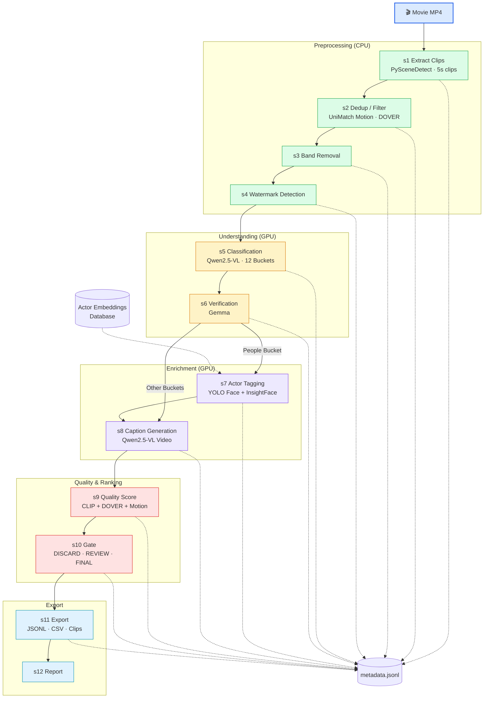

# Indic Video Dataset Pipeline

Code only under `Indic_video_pipeline/`. All runtime outputs go to **`pipeline_outputs/`**. Models live in **`models/`**.

Orchestrated by `run_pipeline.py` — 12 services (s1–s12) share state via **`metadata.jsonl`** per movie workspace.

## Pipeline



## Layout

```text
Indic_video_pipeline/          # code, configs, services (no logs/jsonl here)
/mnt/data0/harsha/new_dataset_pipeline/
  models/                      # Qwen2.5-VL, yolov12n-face.pt
  pipeline_outputs/
    workspaces/<video_id>/     # metadata.jsonl, export/, actor_frames/
    logs/s1..s12/
    reports/
  master/                      # actor_tagger, captioner, actor_embeddings/
```

## Setup

```bash
conda activate indic_video_pipeline
cd /mnt/data0/harsha/new_dataset_pipeline/Indic_video_pipeline
bash scripts/clean_generated.sh      # reset outputs
bash scripts/setup_all_models.sh     # Qwen + YOLO → models/
bash scripts/fix_cuda_torch.sh       # if CUDA false
```

## Run — Devdas

```bash
python run_pipeline.py \
  --movie /mnt/data0/parth/world_models/HunyuanVideo-Avatar/assets/devdas_standard.mp4 \
  --video-id devdas_standard \
  --force
```

Actor tagging only (s1–s7):

```bash
python run_pipeline.py \
  --movie /mnt/data0/parth/world_models/HunyuanVideo-Avatar/assets/devdas_standard.mp4 \
  --video-id devdas_standard \
  --from-step s1 \
  --to-step s7 \
  --force
```

## Outputs

| Type | Path |
|------|------|
| metadata.jsonl | `pipeline_outputs/workspaces/devdas_standard/metadata.jsonl` |
| export csv/jsonl | `pipeline_outputs/workspaces/devdas_standard/export/` |
| actor tags | `pipeline_outputs/workspaces/devdas_standard/actor_tags/` |
| runtime logs | `pipeline_outputs/logs/s*/` |
| reports | `pipeline_outputs/reports/` |

Actor embeddings: `master/actors/actor_embeddings/` (108 actors).
